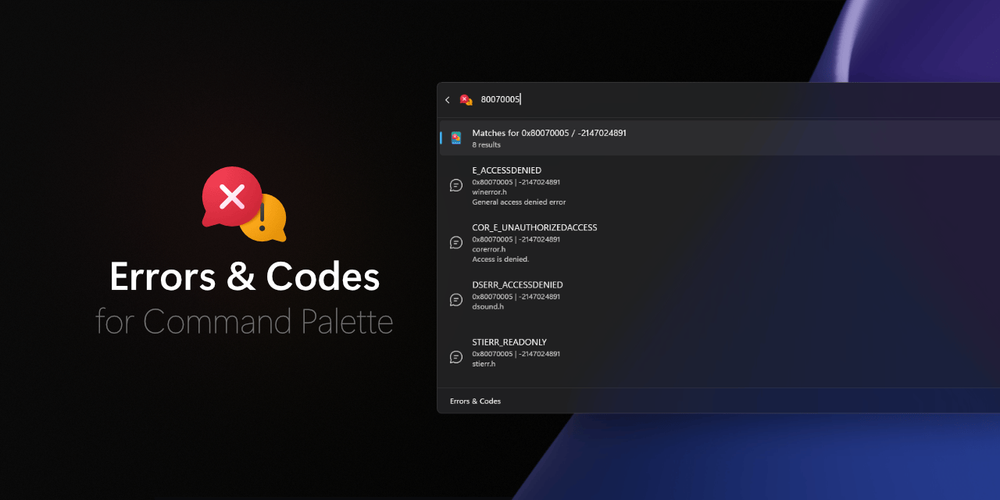

# Errors & Codes for Command Palette



## About

Instantly make sense of cryptic error codes with Errors and Codes for [PowerToys Command Palette](https://learn.microsoft.com/en-us/windows/powertoys/command-palette/overview)! This extension empowers you to quickly access clear, detailed explanations of [NTSTATUS](https://learn.microsoft.com/en-us/openspecs/windows_protocols/ms-erref/87fba13e-bf06-450e-83b1-9241dc81e781), [HRESULT](https://learn.microsoft.com/en-us/openspecs/windows_protocols/ms-erref/0642cb2f-2075-4469-918c-4441e69c548a), and other common Microsoft and Windows error codes—right from the PowerToys Command Palette.

Whether you’re debugging, troubleshooting, or just curious, simply type or paste an error code in any format (hex, decimal, signed, or unsigned) and let the tool do the rest. Errors and Codes for Command Palette automatically detects the format and finds all relevant representations across a variety of Microsoft products.
Drawing on authoritative sources like Winerror.h and Setupapi.h from Windows SDK 10.0.26100, this extension ensures you have the context you need, when you need it. Please note, while the database is extensive, it may not cover every possible error code.
Spend less time searching, and more time solving problems—with error details just a keystroke away.

## Installation

> [!IMPORTANT]  
> Please note that this extension requires PowerToys to be installed in order to function properly.

### Microsoft Store installation (recommended)

<a href="https://apps.microsoft.com/detail/9P2NM9KVRD3G"></a>

### Command Palette


- Open the Command Palette.
- Navigate to the page *Install Command Palette extensions*.
- From the list of extensions, select *Errors & Codes for Command Palette*.

### WinGet

- Open command line
- Enter the following command:

  ```pwsh
  winget install -e --id JiriPolasek.ErrorsandCodesforCommandPalette
  ```

### Manual installation

- Download the installer from the [Releases](https://github.com/jiripolasek/ErrorsAndCodesExtension/releases) section and run it
- Double check that you're are in the original repository

## Licence

Apache 2.0

## Author

[Jiří Polášek](https://jiripolasek.com)